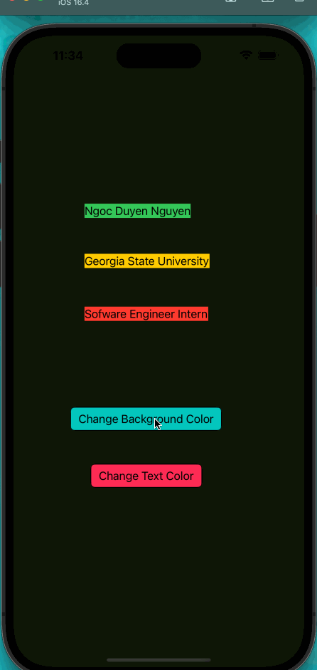

# IOS101 Prework - *Color Change App*

Submitted by: **Ngoc Duyen Nguyen**

**Color Change App** is an app that let users change random color of the background and the texts. 

Time spent: **2** hours spent in total

## Required Features

The following **required** functionality is completed:

- [x] Users are see a screen with three labels and a button
- [x] Tapping the button changes the screen color to a random color
 
## Video Walkthrough

Here's a walkthrough of implemented user stories:

<!-- Replace this with whatever GIF tool you used! -->
GIF created with LICEcap v1.32 on macOS Ventura  
<!-- Recommended tools:
[Kap](https://getkap.co/) for macOS
[ScreenToGif](https://www.screentogif.com/) for Windows
[peek](https://github.com/phw/peek) for Linux. -->

## App Brainstorming (Step 4)

1. **Spotify:**
- Extensive music library: Spotify offers a vast collection of songs, albums, and playlists from various genres and artists.
- Personalized recommendations: The app uses algorithms to suggest music based on user preferences and listening history.
- Collaborative playlists: Users can create and share playlists with friends, allowing for collaborative music discovery.
2. **Evernote:**
- Note-taking versatility: Evernote allows users to create and organize notes in various formats, including text, images, voice recordings, and web clippings.
- Synchronization across devices: Notes are synced across multiple devices, enabling seamless access and editing from anywhere.
- Tagging and search capabilities: Evernote offers robust tagging and search features, making it easy to find specific notes quickly.
3. **Instagram:**
- Visual Storytelling: Instagram allows users to share their stories and experiences through captivating photos and videos. 
- Social Interaction: Instagram provides a platform for users to connect with friends, family, and like-minded individuals. Features like commenting, direct messaging, and the ability to tag others in posts foster meaningful interactions and conversations.
- Explore Tab: The Explore tab in Instagram offers personalized content recommendations based on user preferences and interests. 

**App Idea: TempoTunes**

- TempoTunes is a music app that focuses on helping users discover and enjoy music based on their mood and desired tempo. The app aims to enhance the music listening experience by providing curated playlists and features that align with users' emotional states and desired rhythms.
- Key Features: Mood-Based Playlists, Personalized Recommendations, Lyrics and Song Information, Sleep Timer and Alarm.

## Notes

- Ensure that I have the latest version of Xcode installed on my system. 
- When starting a new project, make sure to select the appropriate template for my application type (e.g., iOS app, macOS app). 
- Understanding the basics of Interface Builder and Auto Layout is crucial for creating responsive and visually appealing interfaces.

## License

    Copyright [2023] [Ngoc Duyen Nguyen]

    Licensed under the Apache License, Version 2.0 (the "License");
    you may not use this file except in compliance with the License.
    You may obtain a copy of the License at

        http://www.apache.org/licenses/LICENSE-2.0

    Unless required by applicable law or agreed to in writing, software
    distributed under the License is distributed on an "AS IS" BASIS,
    WITHOUT WARRANTIES OR CONDITIONS OF ANY KIND, either express or implied.
    See the License for the specific language governing permissions and
    limitations under the License.
